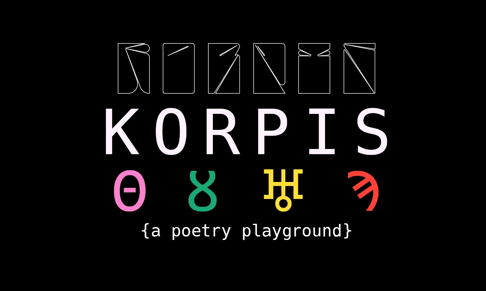
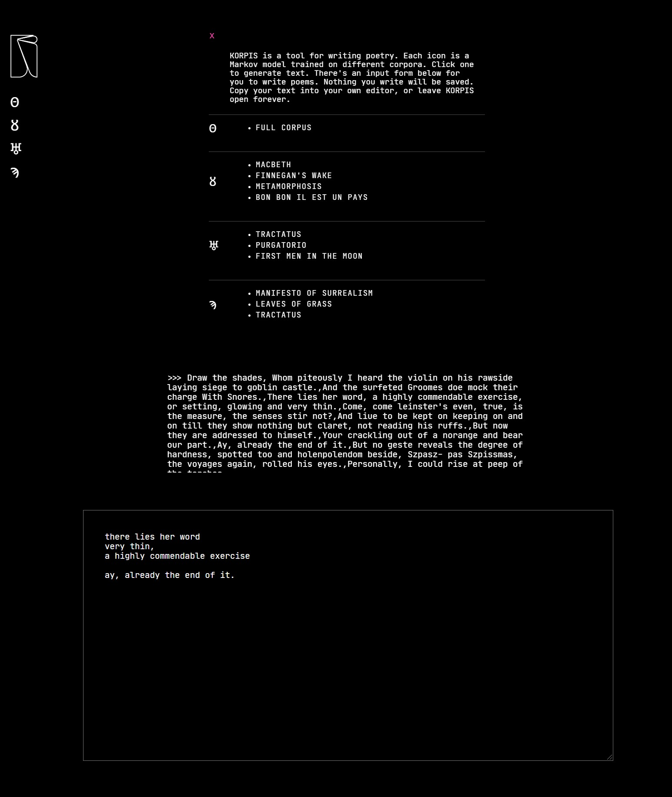

<h3 align="center">KORPIS</h3>

  A tool for writing poetry

# Contents

- [Summary](#summary)
- [Community](#community)
- [Curriculum](#curriculum)
- [Code of conduct](#code-of-conduct)
- [Team](#team)

# Summary

Korpis is a tool for writing poetry. Each icon represents a Markov model trained on different corpora. Clicking an icon will generate a paragraph of text in the style of the writers that the model is trained on. From there, the floor is yours: combine words and phrases to create poems inspired by the results.

The creations are a collaboration between you, an algorithm, and the authors of the original works.

| Model |            Corpora             |
| :---- | :----------------------------: |
| Θ     |          FULL CORPUS           |
| ȣ     |            MACBETH             |
| ȣ     |        FINNEGAN'S WAKE         |
| ȣ     |         METAMORPHOSIS          |
| ♅     |       DANTE'S PURGATORY        |
| ♅     |     FIRST MEN IN THE MOON      |
| ♅     | TRACTATUS LOGICO-PHILOSOPHICUS |
| Ϡ     |        LEAVES OF GRASS         |
| Ϡ     |    MANIFESTO OF SURREALISM     |
| Ϡ     | TRACTATUS LOGICO-PHILOSOPHICUS |

# Environments

## [Browser](#browser)

## [Command Line](#command-line)

## [Haiku Mode](#haiku-mode)

# Browser

The primary KORPIS experience takes place in the browser, where users are able to do the following:

- Generate text from prebuilt models
- Write poems in the text box provided
- Switch to haiku mode
- Save poems to a collection
- Tweet poems

# Command Line

The command line environment is situated toward more technical users. Those who have a light familiarity with python and are inclined to tinker with the mechanics of KORPIS can run and manipulate the program.

At the current stage, the best use of this environment involves splitting a terminal window and writing longform pieces in vim. In future iterations, the command line application will allow users to create and save models fed by uploaded text files without needing to write any code.

The libraries used in the python program differ slightly from those used in the javascript web app. This makes for more customizable results and a deeper experience for writing a long piece.

The command line program currently lives in a separate [repo](https://github.com/ya1sec/po)

# Haiku Mode

HAIKU MODE is a neverending app that feeds users haikus generated by the Surrealist Manifesto. Each nonrepeating word (hapax) was separated into an array determined by its estimated syllable count. The usage is simple: press + and enjoy.

Visiting KORPIS on a mobile device will serve haiku mode instead of the desktop interface, as the primary usage of this application is designed to be best suited for a device that is conducive to writing and multitasking.

# FUTURE

Korpis is still under construction. The following features will be implemented in a future update:

- Save poems to collections in the browser

- Allow users to adjust the state size and number of sentences generated by each model

- Create and save new models with uploaded text files
  (both in browser and command line)

- Generate text from input

- Tweet poems from haiku mode

#

[LIVE APP](https://korpis.herokuapp.com/)
